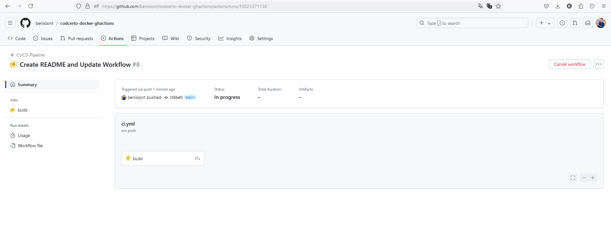
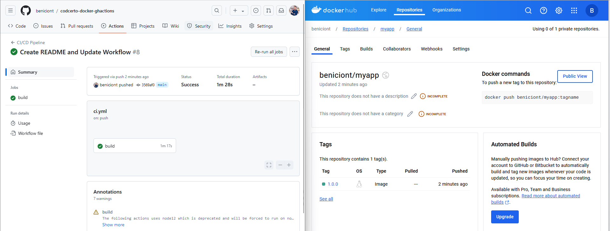

<p align="center"> <strong>Imersão Docker: Docker, AWS e CI</strong></p>
  
<p align="center">Este repositório contém uma API Node.js utilizando NestJS, um banco de dados PostgreSQL e uma interface pgAdmin, todos executados em contêineres Docker. Este projeto demonstra a integração e automação utilizando GitHub Actions para CI/CD..</P>

## Palestrantes

Benício Neto: 

[](https://www.linkedin.com/in/benicio-neto/)

Guilherme Duccini

[](https://www.linkedin.com/in/guilhermeduccini/)

Heberton  Geovane 

[](
https://www.linkedin.com/in/heberton-geovane/)


## Índice

- [Estrutura do Projeto](#estrutura-do-projeto)
- [Pré-requisitos](#pré-requisitos)
- [Configuração do Ambiente](#configuração-do-ambiente)
- [Contato](#contato)

---

## Estrutura do Projeto

- **API (NestJS)**: Aplicação principal em Node.js com NestJS.
- **Banco de Dados (PostgreSQL)**: Serviço de banco de dados relacional.
- **pgAdmin**: Interface web para administração do PostgreSQL.
**1. Clonar o projeto**

## Pré-requisitos

Antes de começar, você precisará de:

- Docker e Docker Compose instalados em sua máquina.
- Conta no Docker Hub (para armazenar imagens Docker).
- Conta no GitHub com permissões para criar Actions e Secrets.

## Configuração do Ambiente

### 1. Clone o Repositório

```
git clone https://github.com/SEU_USUARIO/SEU_REPOSITORIO.git
cd SEU_REPOSITORIO
```
### 2. Configuração do Docker Compose

O arquivo docker-compose.yml define três serviços: db para PostgreSQL, api para a API NestJS e pgadmin para a interface de administração.

Certifique-se de que seu arquivo docker-compose.yml esteja configurado corretamente:

```
version: '3.5'

services:
  db:
    image: postgres
    restart: always
    environment:
      - POSTGRES_PASSWORD=postgres
    container_name: postgres
    volumes:
      - ./pgdata:/var/lib/postgresql/data
    ports:
      - '5432:5432'

  api:
    build:
      context: .
      dockerfile: Dockerfile
    container_name: nest-docker-postgres
    environment:
      - PORT=3000
    ports:
      - '3000:3000'
    depends_on:
      - db
    volumes:
      - ./src:/app/src

  pgadmin:
    image: dpage/pgadmin4
    restart: always
    container_name: nest-pgadmin4
    environment:
      - PGADMIN_DEFAULT_EMAIL=admin@admin.com
      - PGADMIN_DEFAULT_PASSWORD=pgadmin4
    ports:
      - '5050:80'
    depends_on:
      - db
```

### 3. Configuração do GitHub Actions

Para configurar o GitHub Actions, você precisa criar um arquivo de workflow no repositório.

Crie um arquivo chamado .github/workflows/ci-cd.yml com o seguinte conteúdo:

```
name: CI/CD Pipeline

on:
  push:
    branches:
      - main
  pull_request:
    branches:
      - main

jobs:
  build:
    runs-on: ubuntu-latest

    services:
      db:
        image: postgres:latest
        ports:
          - 5432:5432
        env:
          POSTGRES_USER: postgres
          POSTGRES_PASSWORD: postgres

    steps:
      - name: Checkout repository
        uses: actions/checkout@v2

      - name: Set up Docker Buildx
        uses: docker/setup-buildx-action@v2

      - name: Set up QEMU
        uses: docker/setup-qemu-action@v2

      - name: Log in to Docker Hub
        uses: docker/login-action@v2
        with:
          username: ${{ secrets.DOCKER_USERNAME }}
          password: ${{ secrets.DOCKER_HUB_ACCESS_TOKEN }}

      - name: Build and push Docker images
        uses: docker/build-push-action@v2
        with:
          context: .
          push: true
          tags: beniciont/myapp:1.0.0
          
      - name: Set up Node.js
        uses: actions/setup-node@v2
        with:
          node-version: '20'

      - name: Install dependencies
        run: yarn install

      - name: Build application
        run: yarn run build

      - name: Run tests
        run: yarn test --passWithNoTests
```

### 4. Configuração de Secrets no GitHub

Para que o GitHub Actions possa fazer login no Docker Hub e fazer push das imagens, você precisa configurar os seguintes secrets no GitHub:

1. DOCKER_USERNAME: Seu nome de usuário no Docker Hub.
2. DOCKER_PASSWORD: Seu token de acesso do Docker Hub.

Para adicionar secrets:

1. Vá para o repositório no GitHub.
2. Clique em "Settings" > "Secrets and variables" > "Actions".
3. Adicione novos secrets com os nomes e valores apropriados.

### 5. Executar o Docker Compose 

Para iniciar os contêineres Docker localmente, use o comando:

```
docker-compose up -d
```

### 6. Testar a Pipeline 

Faça um commit e push para o branch main para acionar o GitHub Actions e iniciar a pipeline de CI/CD.

```
git add .
git commit -m "Iniciar Pipeline"
git push orign main 
```

Você pode acompanhar a execução dos workflows na aba "Actions" do seu repositório GitHub, exemplo logo abaixo: 



Se tudo correr bem, o workflow será marcado como concluído com sucesso (verde) e você poderá encontrar a imagem do Docker criada no seu repositório no Docker Hub, exemplo logo abaixo:



---
## Recursos Adicionais

- [GitHub Actions Documentation](https://docs.github.com/en/actions)
- [Docker Compose Documentation](https://docs.docker.com/compose/)
- [NestJS Documentation](https://docs.nestjs.com/)

## Contato

Benicio Neto

[](mailto:benicio.neto@outlook.com)
[](https://www.linkedin.com/in/benicio-neto/)
[](https://github.com/beniciont)